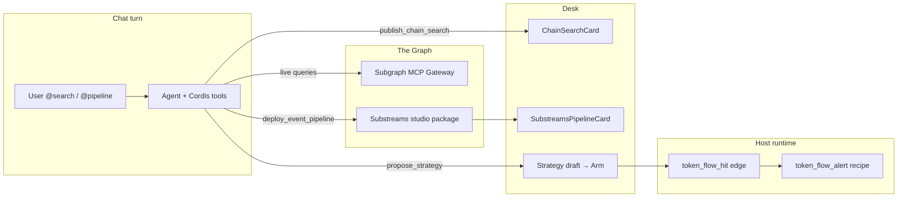

# The Graph usage

How Squadrons uses **The Graph** for onchain discovery and event-driven strategies — Subgraph MCP (Chain Search) plus Substreams (Event Pipeline).

> **Hackathon angle:** EthGlobal **The Graph AI** track — Start Fresh. Featured Substreams challenge: natural-language prompt → authored, deployed Substreams package → strategy that wakes on those hits.

## Why The Graph

| Need | Without Graph | With Graph in Squadrons |
| --- | --- | --- |
| Indexed DEX / pool discovery | GeckoTerminal / invent numbers | **Subgraph MCP** live queries |
| Custom onchain listeners | Host polls + weak Robinhood coverage | **Substreams** package authored from NL |
| Desk UX for judges / ops | Raw tool dumps | GenUI cards in chat |

Robinhood Chain (`4663`) is especially important: GeckoTerminal does not support it well, so Substreams is the primary “listen to swaps / transfers / liquidity / holders” path for top-token style desks.

Official refs: [The Graph AI overview](https://thegraph.com/docs/en/ai-overview/) · [Subgraph MCP](https://thegraph.com/docs/en/ai-suite/subgraph-mcp/introduction/) · [Substreams skills](https://thegraph.com/docs/en/substreams/tooling/skills/)

## Two surfaces

| Desk name | Mention | Cordis / MCP | Artifact `kind` | Job |
| --- | --- | --- | --- | --- |
| **Chain Search** | `@search` / `@graph` | `mcp__subgraph__*` + `publish_chain_search` | `squadrons.chain-search` | Query indexed subgraphs → ranked hits card |
| **Event Pipeline** | `@pipeline` / `/event-pipeline` | `deploy_event_pipeline` | `squadrons.substreams-pipeline` | NL → Substreams package → `token_flow_alert` draft |

Both are **host-provisioned builtins** (Plugins panel → **Included**). Users never paste a Graph API key into the desk.

## Mental model

### Chain Search (Subgraphs)

```
User: @search top Uniswap pools on Base
        │
        ▼
Agent turn (dsh)
  1. mcp__subgraph__*  ──► The Graph Gateway (Bearer key on host)
  2. publish_chain_search ──► .squadrons/chain-search-last.json
        │
        ▼
Host mid/end-turn sync ──► activity tool_result (JSON artifact)
        │
        ▼
Web AgentChat ──► ChainSearchCard GenUI
```

### Event Pipeline (Substreams) → strategy

```
User: @pipeline top tokens on Robinhood (swaps, transfers, liquidity, metadata, holders)
        │
        ▼
deploy_event_pipeline
  • writes .squadrons/pipelines/<pipelineId>/  (yaml, proto, rust stub, sink, head)
  • writes .squadrons/substreams-pipeline-last.json
        │
        ▼
Host sync ──► SubstreamsPipelineCard
        │
        ▼
propose_strategy
  recipeId: token_flow_alert
  params: { pipelineId, minVolumeUsd, minScore }
  trigger: { type: "event", event: "token_flow_hit" }
        │
        ▼
User Arms in desk
        │
        ▼
Host scheduler poll
  evaluateEventEdge(token_flow_hit) ──► sampleTokenFlowHead(pipelineId)
  on edge fire ──► executeTokenFlowAlert ──► activity alert
```



## Operator setup

### Host env

In `apps/host/.env` (see `.env.example`):

```bash
# Shared Gateway key — one key for the whole host (100k free queries/mo typical)
THE_GRAPH_GATEWAY_API_KEY=
```

- When set, host injects Subgraph MCP (`mcp-remote` → `https://subgraphs.mcp.thegraph.com/sse`) for every agent turn.
- When unset, Chain Search shows **Host key** in Plugins and `@search` should report unavailable.
- Event Pipeline (**Substreams**) does **not** require this key — studio authoring runs in-process.

Implementation: [`apps/host/src/plugins/graph-gateway.ts`](../apps/host/src/plugins/graph-gateway.ts)

### Cordis bundles

Always linked into the workspace dsh profile:

- `squadrons-chain-search` — GenUI publisher
- `squadrons-substreams` — pipeline author / deploy

Scripts: [`apps/host/scripts/dsh/repair-profile.sh`](../apps/host/scripts/dsh/repair-profile.sh), [`link-plugins.sh`](../apps/host/scripts/dsh/link-plugins.sh)  
List: [`apps/host/src/dsh/plugins.ts`](../apps/host/src/dsh/plugins.ts)

After pulling Substreams changes:

```bash
pnpm --filter @squadrons/host dsh:link
# restart host so pooled harnesses pick up the new bundle
```

### Desk

1. Create / open an agent (Robinhood home chain for the featured Substreams demo).
2. Plugins → **Chain Search** and **Event Pipeline** should read **Included**.
3. Mention `@search` or `@pipeline` (or `/event-pipeline`) in chat.

## Chat usage

### Chain Search examples

```text
@search Find Uniswap V3 subgraphs and top pools on Base by volume
```

```text
@graph What indexed pools exist for WETH/USDC on Ethereum?
```

Agent must:

1. Call live `mcp__subgraph__*` tools (never invent volumes).
2. Call `publish_chain_search` with flat `hitsJson` (nested Cordis schemas break the plugin tree).

### Event Pipeline examples (featured challenge)

```text
@pipeline Build a top-tokens pipeline on Robinhood Chain that indexes Uniswap swaps, token transfers, pool liquidity changes, token metadata, and holder/buyer activity. Then draft a strategy that alerts on hot token-flow hits.
```

```text
/event-pipeline
Author a Substreams listener for large USDC transfers on Base, deploy it, and propose token_flow_alert with sensible minVolumeUsd.
```

Agent must:

1. `deploy_event_pipeline` (intent, title, summary, chainId, modulesJson, triggerEvent).
2. `propose_strategy` with `token_flow_alert` + `pipelineId` from the deploy result + `token_flow_hit` trigger.
3. Tell the operator to **Arm** — never claim the strategy is running.

Skill copy: [`.agents/skills/event-pipeline/SKILL.md`](../.agents/skills/event-pipeline/SKILL.md)

## Strategy / templates

| Template id | Chain | Recipe | Trigger |
| --- | --- | --- | --- |
| `robinhood-top-token-flow` | `4663` | `token_flow_alert` | `token_flow_hit` |

Catalog: [`packages/shared/src/templates.ts`](../packages/shared/src/templates.ts)

| Recipe | Params | Runtime |
| --- | --- | --- |
| `token_flow_alert` | `pipelineId`, `minVolumeUsd`, `minScore` | Edge when studio stream head crosses thresholds → alert |

Replace template placeholder `pipelineId: "pipe_replace_me"` with the id returned by `deploy_event_pipeline` before Arming.

Related: [Strategies](./STRATEGY.md)

## GenUI artifact contract

Same pattern as Backtest:

1. Cordis tool writes `.squadrons/<thing>-last.json` in the agent workspace.
2. Host detects successful tool result → reads file → publishes `activity` `tool_result` with JSON `detail`.
3. Web SSE parses `kind` → renders card (LLM text still streams).

| Surface | Last file | Sync | Card |
| --- | --- | --- | --- |
| Chain Search | `.squadrons/chain-search-last.json` | [`chain-search-sync.ts`](../apps/host/src/plugins/chain-search-sync.ts) | [`ChainSearchCard.tsx`](../apps/web/src/components/desk/ChainSearchCard.tsx) |
| Event Pipeline | `.squadrons/substreams-pipeline-last.json` | [`substreams-sync.ts`](../apps/host/src/plugins/substreams-sync.ts) | [`SubstreamsPipelineCard.tsx`](../apps/web/src/components/desk/SubstreamsPipelineCard.tsx) |

Shared types: [`packages/shared/src/chain-search.ts`](../packages/shared/src/chain-search.ts), [`packages/shared/src/substreams.ts`](../packages/shared/src/substreams.ts)

SSE wiring: [`apps/web/src/app/agents/[id]/AgentChat.tsx`](../apps/web/src/app/agents/[id]/AgentChat.tsx) · mid-turn publish: [`apps/host/src/agents/routes.ts`](../apps/host/src/agents/routes.ts)

## Code map

### Chain Search (Subgraphs)

| Concern | Path |
| --- | --- |
| Gateway key + MCP URL | [`apps/host/src/plugins/graph-gateway.ts`](../apps/host/src/plugins/graph-gateway.ts) |
| Inject Subgraph MCP into Cordis patch | [`apps/host/src/plugins/mcp-patch.ts`](../apps/host/src/plugins/mcp-patch.ts) |
| Builtin catalog entry (`@search`) | [`packages/shared/src/plugins.ts`](../packages/shared/src/plugins.ts) |
| Cordis `publish_chain_search` | [`packages/squadrons-chain-search/index.js`](../packages/squadrons-chain-search/index.js) |
| Artifact types | [`packages/shared/src/chain-search.ts`](../packages/shared/src/chain-search.ts) |
| Prompt directives | [`apps/host/src/dsh/prompt.ts`](../apps/host/src/dsh/prompt.ts) |
| Activity tool-name detection | [`apps/host/src/dsh/activity-map.ts`](../apps/host/src/dsh/activity-map.ts) |
| Plugins “Included” UX | [`apps/web/src/components/desk/AgentPluginsPanel.tsx`](../apps/web/src/components/desk/AgentPluginsPanel.tsx) |

### Event Pipeline (Substreams)

| Concern | Path |
| --- | --- |
| Cordis `deploy_event_pipeline` | [`packages/squadrons-substreams/index.js`](../packages/squadrons-substreams/index.js) |
| Author package (yaml / proto / rust / sink / head) | [`packages/squadrons-substreams/author.mjs`](../packages/squadrons-substreams/author.mjs) |
| Artifact types | [`packages/shared/src/substreams.ts`](../packages/shared/src/substreams.ts) |
| Recipe catalog + `token_flow_alert` | [`packages/shared/src/recipes.ts`](../packages/shared/src/recipes.ts) |
| Strategy tool enum / validate | [`packages/squadrons-strategy/index.js`](../packages/squadrons-strategy/index.js), [`validate.js`](../packages/squadrons-strategy/validate.js) |
| Studio stream head sampler | [`apps/host/src/strategy/pipeline-head.ts`](../apps/host/src/strategy/pipeline-head.ts) |
| Event edge `token_flow_hit` | [`apps/host/src/strategy/events.ts`](../apps/host/src/strategy/events.ts) |
| Recipe executor | [`apps/host/src/strategy/recipes/token-flow.ts`](../apps/host/src/strategy/recipes/token-flow.ts) |
| Robinhood template | [`packages/shared/src/templates.ts`](../packages/shared/src/templates.ts) (`robinhood-top-token-flow`) |
| Slash skill | [`.agents/skills/event-pipeline/SKILL.md`](../.agents/skills/event-pipeline/SKILL.md) |
| Desk skill picker | [`packages/shared/src/skills.ts`](../packages/shared/src/skills.ts) |

## Studio vs live Substreams gateway

`engine: "studio"` on the pipeline artifact means Squadrons authors a full Substreams package in the agent workspace and maintains a **deterministic stream head** for strategy edges (same idea as Backtest’s `engine: "simulation"`).

That keeps demos and Arm loops reliable without requiring a separate Substreams sink subscription on every hackathon laptop. The package under `.squadrons/pipelines/<id>/` is the handoff artifact for real Substreams Studio / sink deploy when you wire a gateway later.

## EthGlobal talking points

| Track / challenge | What to show |
| --- | --- |
| **The Graph AI — Start Fresh** | Squadrons desk + agents; Graph is a first-class builtin, not a bolt-on |
| **Subgraph MCP** | `@search` → live Gateway queries → Chain Search card |
| **Featured Substreams challenge** | `@pipeline` NL → authored package + GenUI → `token_flow_alert` Arm on Robinhood |
| **Robinhood use case** | Swaps, transfers, liquidity, metadata, holders → top-token flow alerts |

## Limits & gotchas

- Cordis tool parameters must stay **flat** (`hitsJson` / `modulesJson` strings). Nested object-array schemas have crashed the whole plugin tree.
- MCP Cordis rows must use **`- insert:`** (see `mcp-patch.ts`); bare `- id:` fails with `entry not found` and can surface as a fake OpenRouter `NO_ADAPTER` error.
- Restart the host after `dsh:link` / Gateway key changes so agent harnesses rebuild (`prepare.ts` plugins hash).
- Chain Search without `THE_GRAPH_GATEWAY_API_KEY` cannot invent subgraph data — say unavailable.
- Template `pipe_replace_me` will validate but will not match a real deploy until replaced.

## Related docs

- [Strategies](./STRATEGY.md) — Arm, recipes, event triggers
- [Arc usage](./arc_usage.md) — Circle Swap Kit (separate bounty surface)
- Package READMEs: [squadrons-chain-search](../packages/squadrons-chain-search/README.md) · [squadrons-substreams](../packages/squadrons-substreams/README.md)
