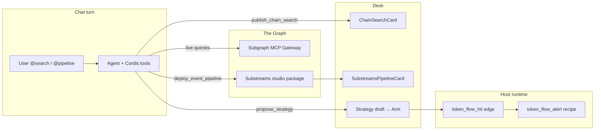

# The Graph usage

How Squadrons uses **The Graph** for onchain discovery and event-driven strategies — Subgraph MCP (Chain Search) plus Substreams (Event Pipeline).

Both surfaces are **host-provisioned builtins** (Plugins → **Included**). Operators never paste a Graph API key into the desk.

## Why The Graph

| Need | Without Graph | With Graph in Squadrons |
| --- | --- | --- |
| Indexed DEX / pool discovery | GeckoTerminal or invented numbers | **Subgraph MCP** live queries |
| Custom onchain listeners | Host polls; weak Robinhood coverage | **Substreams** package authored from natural language |
| Desk UX | Raw tool dumps | GenUI cards in chat |

Robinhood Chain (`4663`) is a strong fit: GeckoTerminal coverage is weak there, so Substreams is the main path for swaps / transfers / liquidity / holders style desks.

## What we use

| Feature | In product | Implementation |
| --- | --- | --- |
| Chain Search | `@search` / `@graph` → live subgraph queries → ranked hits card | [`graph-gateway.ts`](../apps/host/src/plugins/graph-gateway.ts) · [`mcp-patch.ts`](../apps/host/src/plugins/mcp-patch.ts) · [`squadrons-chain-search`](../packages/squadrons-chain-search/index.js) · [`chain-search-sync.ts`](../apps/host/src/plugins/chain-search-sync.ts) · [`ChainSearchCard.tsx`](../apps/web/src/components/desk/ChainSearchCard.tsx) |
| Event Pipeline | `@pipeline` / `/event-pipeline` → NL → Substreams package → strategy draft | [`squadrons-substreams`](../packages/squadrons-substreams/index.js) · [`author.mjs`](../packages/squadrons-substreams/author.mjs) · [`substreams-sync.ts`](../apps/host/src/plugins/substreams-sync.ts) · [`SubstreamsPipelineCard.tsx`](../apps/web/src/components/desk/SubstreamsPipelineCard.tsx) |
| Builtin catalog | Plugins panel shows both as **Included** | [`plugins.ts`](../packages/shared/src/plugins.ts) · [`AgentPluginsPanel.tsx`](../apps/web/src/components/desk/AgentPluginsPanel.tsx) |
| Prompt / activity | Agent directives + tool name mapping | [`prompt.ts`](../apps/host/src/dsh/prompt.ts) · [`activity-map.ts`](../apps/host/src/dsh/activity-map.ts) |
| Strategy edge | `token_flow_alert` on `token_flow_hit` | [`recipes.ts`](../packages/shared/src/recipes.ts) · [`pipeline-head.ts`](../apps/host/src/strategy/pipeline-head.ts) · [`events.ts`](../apps/host/src/strategy/events.ts) · [`token-flow.ts`](../apps/host/src/strategy/recipes/token-flow.ts) |
| Template | `robinhood-top-token-flow` (chain `4663`) | [`templates.ts`](../packages/shared/src/templates.ts) |
| Cordis bundles | Linked into the dsh profile | [`plugins.ts`](../apps/host/src/dsh/plugins.ts) · [`link-plugins.sh`](../apps/host/scripts/dsh/link-plugins.sh) |
| Skill | `/event-pipeline` slash skill | [`.agents/skills/event-pipeline/SKILL.md`](../.agents/skills/event-pipeline/SKILL.md) · [`skills.ts`](../packages/shared/src/skills.ts) |

| Desk name | Mention | Cordis / MCP | Artifact `kind` |
| --- | --- | --- | --- |
| **Chain Search** | `@search` / `@graph` | `mcp__subgraph__*` + `publish_chain_search` | `squadrons.chain-search` |
| **Event Pipeline** | `@pipeline` / `/event-pipeline` | `deploy_event_pipeline` | `squadrons.substreams-pipeline` |

## Mental model

### Chain Search (Subgraphs)

```
User: @search top Uniswap pools on Base
        │
        ▼
Agent turn (dsh)
  1. mcp__subgraph__*  ──► The Graph Gateway (Bearer key on host)
  2. publish_chain_search ──► .squadrons/chain-search-last.json
        │
        ▼
Host mid/end-turn sync ──► activity tool_result (JSON artifact)
        │
        ▼
Web AgentChat ──► ChainSearchCard GenUI
```

### Event Pipeline (Substreams) → strategy

```
User: @pipeline top tokens on Robinhood (swaps, transfers, liquidity, metadata, holders)
        │
        ▼
deploy_event_pipeline
  • writes .squadrons/pipelines/<pipelineId>/  (yaml, proto, rust stub, sink, head)
  • writes .squadrons/substreams-pipeline-last.json
        │
        ▼
Host sync ──► SubstreamsPipelineCard
        │
        ▼
propose_strategy
  recipeId: token_flow_alert
  params: { pipelineId, minVolumeUsd, minScore }
  trigger: { type: "event", event: "token_flow_hit" }
        │
        ▼
User Arms in desk
        │
        ▼
Host scheduler poll
  evaluateEventEdge(token_flow_hit) ──► sampleTokenFlowHead(pipelineId)
  on edge fire ──► executeTokenFlowAlert ──► activity alert
```



## Operator setup

### Host (`apps/host/.env`)

```bash
# Shared Gateway key for the whole host
THE_GRAPH_GATEWAY_API_KEY=
```

- When set: host injects Subgraph MCP (`mcp-remote` → Gateway SSE) on every agent turn.
- When unset: Chain Search shows **Host key** in Plugins; `@search` should report unavailable.
- Event Pipeline does **not** need this key — studio authoring runs in-process.

### Cordis bundles

Always linked: `squadrons-chain-search`, `squadrons-substreams`.

```bash
pnpm --filter @squadrons/host dsh:link
# restart host so pooled harnesses pick up the new bundle
```

### Desk

1. Create / open an agent (Robinhood home chain for the top-token Substreams loop).
2. Plugins → **Chain Search** and **Event Pipeline** should read **Included**.
3. Mention `@search` or `@pipeline` (or `/event-pipeline`) in chat.

## Chat usage

### Chain Search

```text
@search Find Uniswap V3 subgraphs and top pools on Base by volume
```

```text
@graph What indexed pools exist for WETH/USDC on Ethereum?
```

Agent must:

1. Call live `mcp__subgraph__*` tools (never invent volumes).
2. Call `publish_chain_search` with flat `hitsJson` (nested Cordis schemas break the plugin tree).

### Event Pipeline

```text
@pipeline Build a top-tokens pipeline on Robinhood Chain that indexes Uniswap swaps, token transfers, pool liquidity changes, token metadata, and holder/buyer activity. Then draft a strategy that alerts on hot token-flow hits.
```

```text
/event-pipeline
Author a Substreams listener for large USDC transfers on Base, deploy it, and propose token_flow_alert with sensible minVolumeUsd.
```

Agent must:

1. `deploy_event_pipeline` (intent, title, summary, chainId, modulesJson, triggerEvent).
2. `propose_strategy` with `token_flow_alert` + `pipelineId` from the deploy + `token_flow_hit` trigger.
3. Tell the operator to **Arm** — never claim the strategy is already running.

## Strategy / templates

| Template id | Chain | Recipe | Trigger |
| --- | --- | --- | --- |
| `robinhood-top-token-flow` | `4663` | `token_flow_alert` | `token_flow_hit` |

| Recipe | Params | Runtime |
| --- | --- | --- |
| `token_flow_alert` | `pipelineId`, `minVolumeUsd`, `minScore` | Edge when studio stream head crosses thresholds → alert |

Replace template placeholder `pipelineId: "pipe_replace_me"` with the id from `deploy_event_pipeline` before Arming.

## GenUI artifact contract

Same pattern as Backtest:

1. Cordis tool writes `.squadrons/<thing>-last.json` in the agent workspace.
2. Host detects a successful tool result → reads file → publishes `activity` `tool_result` with JSON `detail`.
3. Web SSE parses `kind` → renders the card (LLM text still streams).

| Surface | Last file | Sync | Card |
| --- | --- | --- | --- |
| Chain Search | `.squadrons/chain-search-last.json` | [`chain-search-sync.ts`](../apps/host/src/plugins/chain-search-sync.ts) | [`ChainSearchCard.tsx`](../apps/web/src/components/desk/ChainSearchCard.tsx) |
| Event Pipeline | `.squadrons/substreams-pipeline-last.json` | [`substreams-sync.ts`](../apps/host/src/plugins/substreams-sync.ts) | [`SubstreamsPipelineCard.tsx`](../apps/web/src/components/desk/SubstreamsPipelineCard.tsx) |

Types: [`chain-search.ts`](../packages/shared/src/chain-search.ts) · [`substreams.ts`](../packages/shared/src/substreams.ts)  
SSE: [`AgentChat.tsx`](../apps/web/src/app/agents/[id]/AgentChat.tsx) · mid-turn publish in [`routes.ts`](../apps/host/src/agents/routes.ts)

## Studio vs live Substreams gateway

`engine: "studio"` on the pipeline artifact means Squadrons authors a full Substreams package in the agent workspace and keeps a **deterministic stream head** for strategy edges (same idea as Backtest’s `engine: "simulation"`).

That keeps Arm loops reliable without a separate sink subscription on every machine. The package under `.squadrons/pipelines/<id>/` is the handoff for a real Studio / sink deploy when you wire a gateway later.

## Limits & gotchas

- Cordis tool parameters must stay **flat** (`hitsJson` / `modulesJson` strings). Nested object-array schemas have crashed the whole plugin tree.
- MCP Cordis rows must use **`- insert:`** (see [`mcp-patch.ts`](../apps/host/src/plugins/mcp-patch.ts)); bare `- id:` fails with `entry not found` and can surface as a fake OpenRouter `NO_ADAPTER` error.
- Restart the host after `dsh:link` / Gateway key changes so agent harnesses rebuild.
- Chain Search without `THE_GRAPH_GATEWAY_API_KEY` cannot invent subgraph data — say unavailable.
- Template `pipe_replace_me` validates but will not match a real deploy until replaced.
