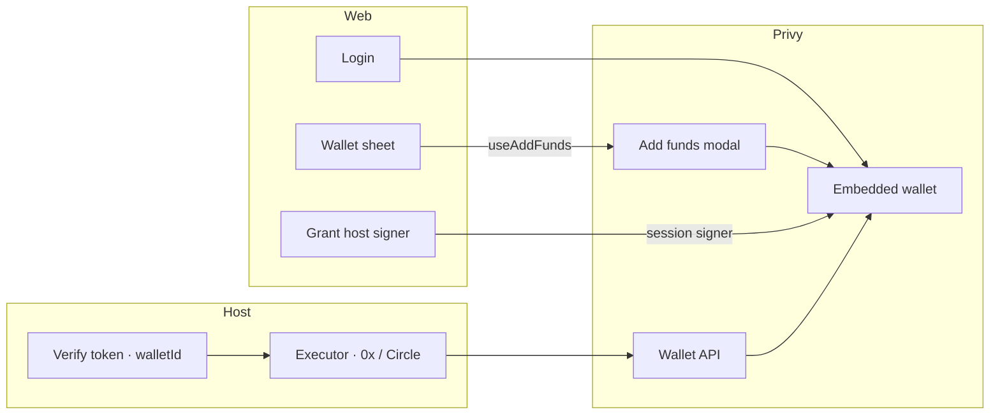

# Privy usage

How Squadrons uses **Privy** for auth, the shared embedded wallet, funding, and live broadcast.

v1 custody is **one Privy embedded wallet per user**, shared by all of that user’s agents. Agents never hold private keys — the host signs only after the operator grants a session signer, and only under desk policy / execution mode.

## Why Privy

| Concern | What we do |
| --- | --- |
| Login | Email or external wallet — desk is gated until authenticated |
| Wallet | Embedded Ethereum wallet created on login (`createOnLogin: "all-users"`) |
| Funding | Wallet sheet **Add funds** — fiat onramp and/or crypto deposit into USDC |
| Agent spend | Operator grants the host authorization key as a **session signer** once |
| Settlement | Host Live path → Wallet API `sendTransaction` (Arc: Circle Kit via a Privy EIP-1193 adapter) |

Login and money movement stay in one product surface; keys never land in Squadrons storage. We do **not** use Privy Cards for the core loop.

## What we use

| Feature | In product | Implementation |
| --- | --- | --- |
| Auth (email + wallet) | Desk gate; every host API/SSE call carries the access token | [`Providers.tsx`](../apps/web/src/components/Providers.tsx) · [`AuthGate.tsx`](../apps/web/src/components/AuthGate.tsx) · [`host.ts`](../apps/web/src/lib/host.ts) · [`privy.ts`](../apps/host/src/auth/privy.ts) (`verifyAccessToken`) |
| Embedded wallet | One address + `walletId` per user; injected as `SQUADRONS_USER_WALLET` on agent turns | [`Providers.tsx`](../apps/web/src/components/Providers.tsx) (`embeddedWallets`) · [`privy.ts`](../apps/host/src/auth/privy.ts) (`pickEthereumWallet` / `UserStore`) |
| Add funds | Wallet sheet → fiat or crypto → USDC on a settle-supported chain | [`WalletSheet.tsx`](../apps/web/src/components/desk/WalletSheet.tsx) (`useAddFunds`) · [`funding.ts`](../apps/web/src/lib/funding.ts) |
| Session signers | **Grant access** once so the host can broadcast under Live | [`useHostSigner.ts`](../apps/web/src/hooks/useHostSigner.ts) · [`WalletSheet.tsx`](../apps/web/src/components/desk/WalletSheet.tsx) |
| Wallet API broadcast | Live 0x swaps (approve + swap when needed) | [`broadcast.ts`](../apps/host/src/strategy/broadcast.ts) · [`executor.ts`](../apps/host/src/strategy/executor.ts) |
| Privy EIP-1193 adapter | Arc Live: Circle `kit.swap` → `eth_sendTransaction` → same broadcast helper | [`circle-swap.ts`](../apps/host/src/strategy/circle-swap.ts) |

## Money flow

```
Login (email / wallet)
        │
        ▼
Embedded wallet created / linked
        │
        ├─ Add funds ──► fiat or crypto ──► USDC on Base / ETH / Arb / OP
        │
        └─ Grant host signer (once)
                │
                ▼
        Agent Observe / Paper (quotes only, no broadcast)
                │
                ▼
        Agent Live + Arm
                │
                ▼
        Host: build swap → policy / Tenderly → Privy sendTransaction
```



### Desk steps

1. Log in — embedded wallet shows in the Wallet sheet.
2. **Add funds** — destination follows the agent’s home chain when it’s in the settle map; otherwise Base with a fallback note.
3. **Grant access** — attach the host authorization key for Live broadcast.
4. Observe / Paper first; Live only when host `SQUADRONS_EXECUTION_MODE=live` and you intend real txs.

Observe / Paper never call Privy broadcast. Live fails closed without the auth key, session grant, or `walletId`.

## Funding destinations

| Chain | CAIP-2 | Asset |
| --- | --- | --- |
| Base | `eip155:8453` | USDC |
| Ethereum | `eip155:1` | USDC |
| Arbitrum | `eip155:42161` | USDC |
| Optimism | `eip155:10` | USDC |

Map lives in [`funding.ts`](../apps/web/src/lib/funding.ts). Other home chains (Arc, Robinhood, Unichain, World Chain, …) fall back to **USDC on Base**. Fiat defaults: USD (EUR offered), amount `50`, env from `NEXT_PUBLIC_PRIVY_FUNDING_ENV` (`sandbox` | `production`).

## Mental model (web ↔ host)

```
Web
  PrivyProvider (app id, supportedChains, embedded createOnLogin)
  AuthGate → login
  host.ts → getAccessToken() on API / SSE
  WalletSheet → addFunds / ensureHostSigner
        │
        ▼
Host
  requireUser → verifyAccessToken → users._get → pick embedded 0x + walletId
  UserStore upsert (id, wallet_address, wallet_id)
  dsh turn env: SQUADRONS_USER_WALLET
        │
        ▼
Live tick
  build swap (0x | Circle Swap Kit)
  optional Tenderly sim + policy caps
  wallets().ethereum().sendTransaction(walletId, caip2, tx, authorization_private_keys)
```

## Operator setup

### Web (`apps/web/.env.local`)

```bash
NEXT_PUBLIC_PRIVY_APP_ID=
NEXT_PUBLIC_PRIVY_SIGNER_ID=          # auth key quorum id
# NEXT_PUBLIC_PRIVY_FUNDING_ENV=sandbox
```

### Host (`apps/host/.env`)

```bash
PRIVY_APP_ID=
PRIVY_APP_SECRET=
PRIVY_AUTHORIZATION_PRIVATE_KEY=      # PKCS8 base64; strip wallet-auth: if present
PRIVY_AUTHORIZATION_KEY_QUORUM_ID=
SQUADRONS_EXECUTION_MODE=dry_run      # live only when ready to broadcast
```

Dashboard: embedded wallets on login, funding enabled for the env you use, authorization key (private key on host, quorum id on web + host).

## Live broadcast

| Path | Builder | Broadcast |
| --- | --- | --- |
| Chains with 0x | `buildSwapFromPlan` (+ approve when needed) | [`broadcastEvmTx`](../apps/host/src/strategy/broadcast.ts) |
| Arc Testnet | Circle `kit.swap` via Privy EIP-1193 (`eth_sendTransaction` only) | same helper under the hood |

Needs: desk **Live**, host `SQUADRONS_EXECUTION_MODE=live`, auth key set, session signer granted, user row has `walletId`.

## Limits & gotchas

- Funding settle map is four chains — extend `FUNDING_CHAINS` when more routes are available.
- Missing `walletId` after login → re-login (linked embedded account not visible yet).
- Desk Live cannot exceed the host execution ceiling.
- Access token authenticates APIs; identity token is only needed if you add user-jwt Wallet API signing later.
- Circle quote-only path may use an ephemeral key for estimates — user funds still only move through Privy.
